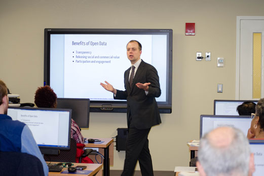

# Introduction to Open Data

## [Click here for tickets](https://www.eventbrite.com/e/seeing-dallas-in-data-an-introduction-to-open-data-in-dfw-tickets-55724131377?aff=github)

## Background
A workshop given as part of the [2016 NYC DCAS Expo](http://www.nyc.gov/html/dcas/downloads/pdf/misc/expo2016.pdf). [Original slides are available online](http://www.datapolitan.com/talks_lectures/20160108_OpenDataExpo). Current slides are available at http://training.datapolitan.com/intro-open-data.

## Overview
As more and more data is released to the public through open data portals, such as [the portal hosted by the City of Dallas](https://www.dallasopendata.com/), we have an unprecendented opportunity to understand the state of our communities and how our government is working. While accessing this information may be easier, accessing the right information can be challenging and understanding it even harder.

Join us for an introduction to open data, an overview of several open data portals in the DFW area, and a short exploration of the available data to get you started on your journey of data adventure. This class is the beginning of a series of classes we're currently developing using open data to teach valuable analytics skills while learning about our communities.

Whether you have a particular story you'd like to tell about your community or want to find the stories yet untold, bring your laptops and join us for two hours of engaging discussion and hands-on exploration of real problems with real data.

_Please note: We are unable to provide computers for those without laptops of their own, but will happily work with any browser or spreadsheet program you have installed and available. Don't have Microsoft Office? No worries! Try these free, open-source office solutions: [OpenOffice](https://www.openoffice.org/) and [LibreOffice](https://www.libreoffice.org/). Also, if you have a Google account, you're welcome to use Google Sheets. You're welcome to join if you don't have a computer and we'll be happy to pair you with someone who does._

## Outline
+ **Welcome**
	+ Activity: Facilitator welcomes participants to the class, introduces themselves, establishes some ground rules, and addresses any logistical questions about the class and the space
+ **Introductions**
	+ Activity: Facilitator has participants introduce themselves to the class
	+ Task to participants: Introduce yourself to the person next to you, offering your name, what you currently do, and one fact that surprised you
	+ Outcome: Participants are familiar with each other and comfortable in the space
	+ Format: Facilitated partner/group discussion
+ **Portal Exercise**
	+ Activity: Facilitator has participants explore an open data portal on their own to gain experience and insight into open data as it exists in their communities
	+ Task to participants: Explore one of the portals listed on the slides and find 2-3 datasets that look interesting. Be ready to talk about what you found, why it seemed interesting, and the experience of finding the data
	+ Outcome: Participants familiarize themselves with open data as it exists in the various available portals, finding information they find interesting, and are familiar with the process of accessing the data
	+ Format: Individual/partner exercise with facilitated discussion
+ **Reflection** 
	+ Activity: Facilitator reflects with the participants on what they experienced in exploring both the data and the portals
	+ Task to participants: Reflect on the experience of going through the portals. Based on what you saw, how would you define "open data" to someone who's never been on an open data portal or heard the term "open data"?
	+ Outcome: Participants synthesize their experience on the open data portals and past experiences to craft a working definition of open data
	+ Format: Facilitated group discussion
+ **What is Open Data?**
	+ Activity: Facilitator provides context by describing the key terms, concepts, and issues with open data
	+ Task to participants: Based on what you know about open data, how do the definitions and aspects of open data presented resonate with your experience?
	+ Outcome: Participants are familiar with key terms, ideas, and issues with open data
	+ Format: Facilitated lecture and group discussion
+ **Guided Exercise**
	+ Activity: Facilitator guides participants through an example exercise in filtering and downloading a dataset from an open data portal
	+ Task to participants: We're going to choose one of the datasets you found and go through the process of filtering and downloading the data. We'll use this as an example of how to get data out of a portal. Later, I'm going to ask you to find your own dataset and do the same thing. 
	+ Outcome: Participants are familiar with how to filter and download data from the example open data portal
	+ Format: Facilitated guided task and group discussion
+ **5 Data Analytics Tasks**
	+ Activity: Facilitator describes the 5 basic data analytics tasks and provides a short demonstration of how to perform the task on the sample data
	+ Task to participants: We're going to introduce the 5 key data analytics tasks and review some simple ways to apply them to this dataset. This will be an example of what you can do with the dataset you choose
	+ Outcome: Participants are familiar with the basic tasks in data analysis and able to apply them to a dataset of their choosing
	+ Format: Facilitated lecture, guided exercise, and group discussion
+ **Individual/Group Exercise**
	+ Activity: Facilitator supports the participants in their own exploration of a dataset or further exploration of the example dataset in order to tell a story from the data
	+ Task to participants: Find a dataset of your own or continue working with this dataset, but try and find a story in the data that you want to share. We won't have much time, so it doesn't need to be a complete story, but something that is interesting and compelling to you. Be prepared to share your story to the group.
	+ Outcome: Participants have practiced the tasks covered by applying them to an example of their own choosing
	+ Format: Supported individual/partner/small group work
+ **Presentations**
	+ Activity: Participants present the story, or at least as much of the story as they were able to tell in the available time, to the class
	+ Task to participants: Share the story with the group or as much of the story as you were able to tell in the time we had, telling us what your question was, why it was interesting, where you found the data, and what you did to make the data meaningful
	+ Outcome: Participants are practiced at presenting findings to an audience
	+ Format: Individual/group presentations
+ **Wrap-up**
	+ Activity: Facilitator reviews the learning experience with the participants, reinforcing key points, soliciting feedback on the learning, and providing additional resources for further information
	+ Task to participants: What are the key ideas we covered today that resonate with you? What are some additional questions you have?
	+ Outcome: Participants have key ideas reinforced, are able to ask any remaining questions, and are resourced for further exploration of the topics presented
	+ Format: Facilitated group discussion

## FAQs

**Should I be familiar with the open data portal before arriving?**

Not at all! We assume no prior knowledge and will be covering key topics in class, as well as letting you explore on your own as we go.

**Should I be a data rockstar to even think of attending?**

No! We take all comers, even if you consider "data" a four-letter word of ill-repute. We do our best to engage and help everyone learn no matter how familiar (or unfamiliar) you are with the data or the tools.

**What are my transportation/parking options for getting to and from the event?**

Goodwork has plenty of parking in front for people joining the event. There is also on-street parking if there are no spots available in front (very unlikely).

**What can I bring into the event?**

Please bring a notebook, a laptop with some spreadsheet application available, and your curiosity. We'll be going online to explore several open data portals, download data, and do some basic analysis of what we find. The lecture materials will be hosted online for reference.

**How can I contact the organizer with any questions?**

Please feel free to reach out to training@datapolitan.com with any questions you have about the event.

**What's the refund policy?**

Life happens and while we'd love to see everyone who registers show up for the class, we're happy to offer refunds for people who provide at least 24 hours notice.

## Resources
+ [Open Data Handbook](http://opendatahandbook.org/)
+ [State of the Union of Open Data](https://www.datafoundation.org/the-state-of-the-union-of-open-data-ed-3)
+ [Ancient Origins of Open Access Law](https://opengovdata.io/2014/ancient-origins-open-access-to-law/) by [Joshua Tauberer](https://razor.occams.info/)
+ [A Brief History of Open Data](http://parisinnovationreview.com/articles-en/a-brief-history-of-open-data) by [Simon Chignard](https://donneesouvertes.info/) in the Paris Innovation Review

